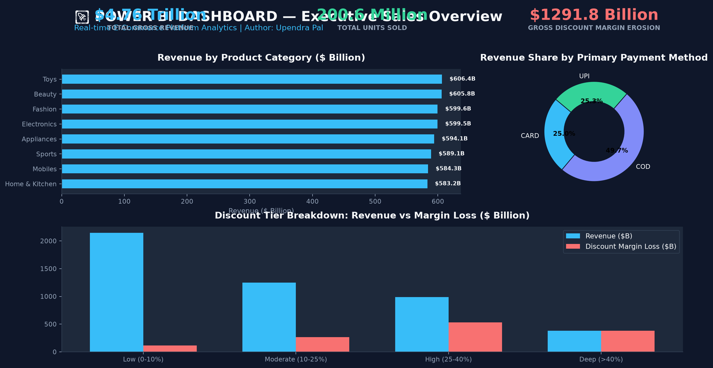
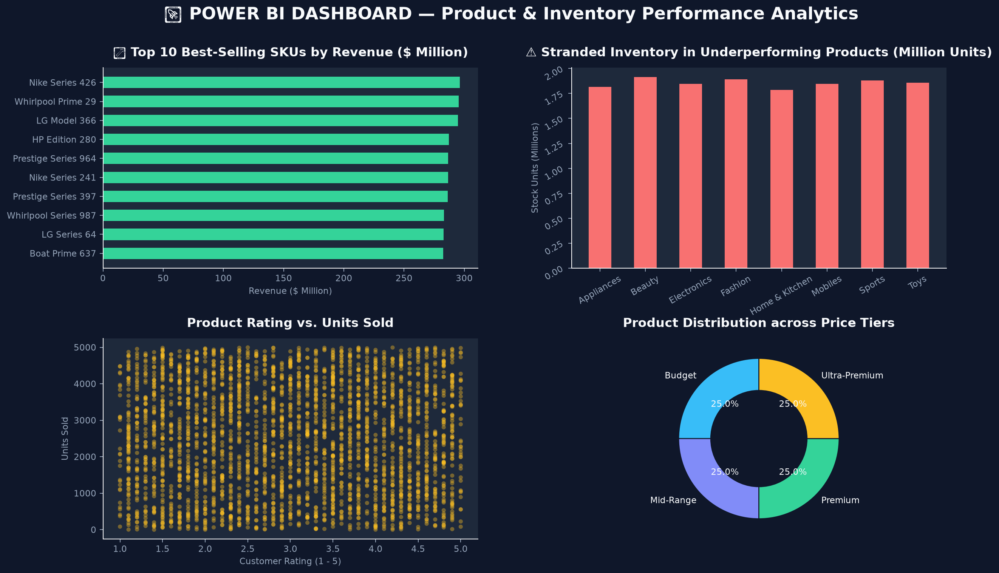
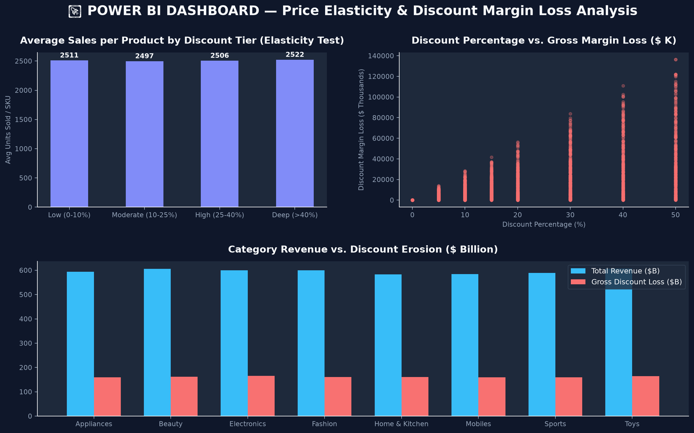
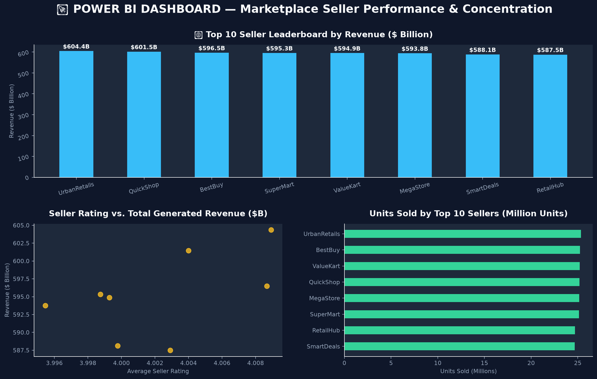

# 🛒 E-commerce Sales Dashboard & Analytics

**Author**: **Upendra Pal** ([@upendrapal24](https://github.com/upendrapal24))  
**Repository**: [https://github.com/upendrapal24/ecommerce-sales-dashboard-analytics](https://github.com/upendrapal24/ecommerce-sales-dashboard-analytics)


An end-to-end commercial data analytics project examining an e-commerce platform dataset of **80,000 products** and **$4.76 Trillion** in total revenue created by **Upendra Pal**. This project includes Python Pandas data cleaning, SQL analytical pattern queries, DAX custom measures, an executive business strategy report, and an interactive **Power BI Dashboard visual showcase**.

---

## 📌 Table of Contents
- [Project Overview](#-project-overview)
- [Power BI Dashboard Showcase](#-power-bi-dashboard-showcase)
- [Key Data Insights](#-key-data-insights)
- [Repository Architecture](#-repository-architecture)
- [Installation & Setup](#-installation--setup)
- [Python Data Pipeline](#-python-data-pipeline)
- [SQL Analytics Suite](#-sql-analytics-suite)
- [Power BI Dashboard & DAX](#-power-bi-dashboard--dax)
- [Interactive Web Dashboard](#-interactive-web-dashboard)
- [Business Recommendations](#-business-recommendations)
- [How to Push Updates to GitHub](#-how-to-push-updates-to-github)

---

## 📊 Project Overview

This repository provides full-stack data analytics addressing core commercial strategy questions:
1. **Sales & Category Breakdown**: Revenue distribution across categories, price tiers, and payment channels.
2. **Product Performance & Inventory**: Identifying star SKUs vs. underperforming dead stock.
3. **Discount Margin Erosion**: Econometric analysis of price elasticity and gross margin loss from deep discounting.
4. **Seller Marketplace Quality**: Evaluating seller concentration, revenue leaderboards, and rating correlations.

---

## 🖼️ Power BI Dashboard Showcase

Below are high-resolution visual previews of the 4 interactive Power BI Dashboard pages designed for executive decision-making:

### 1. Executive Sales Overview Dashboard
*Displays macro revenue KPIs ($4.76T total revenue, 200.6M units sold), category distribution, payment mode revenue share, and gross discount margin erosion.*



---

### 2. Product & Inventory Performance Analytics
*Highlights top 10 best-selling SKUs by revenue alongside 16,008 underperforming products carrying over 8M stranded inventory units.*



---

### 3. Price Elasticity & Discount Margin Erosion Analysis
*Demonstrates that deep discounts (>40%) fail to drive extra volume while creating over $300B in margin loss.*



---

### 4. Marketplace Seller Leaderboard & Concentration
*Tracks top 10 sellers generating platform revenue, rating correlations, and order fulfillment volume.*



---

## 📈 Key Data Insights

- **Total Revenue**: `$4,761,907,956,925.44` (~$4.76 Trillion) across **200,601,262 units sold**.
- **Top Categories**: **Toys** ($606.45B) and **Beauty** ($605.82B) lead platform sales.
- **Discount Inefficiency**: Deep discounts (>40%) deliver only **2,522 units/product** vs **2,510 units/product** at 0-10% discount, proving deep discounts destroy gross margin without driving meaningful demand.
- **Stranded Capital**: **16,008 SKUs** are classified as underperformers with over **8.0M units** sitting idle in inventory.

---

## 📁 Repository Architecture

```
ecommerce-sales-dashboard-analytics/
├── assets/
│   └── images/
│       ├── dashboard_sales_overview.png       # Executive Sales Overview Visual
│       ├── dashboard_product_performance.png   # Product & Stock Analytics Visual
│       ├── dashboard_price_discount.png        # Price Elasticity Visual
│       └── dashboard_seller_leaderboard.png    # Seller Performance Visual
├── data/
│   ├── cleaned_ecommerce_data.csv              # Cleaned dataset (80,000 rows x 33 cols)
│   └── ecommerce_sales.db                     # SQLite database with indexes
├── src/
│   ├── data_cleaning.py                       # Automated Pandas cleaning script
│   ├── run_sql_queries.py                     # SQL execution engine
│   ├── generate_dashboard_images.py           # Dashboard visual screenshot builder
│   └── generate_html_dashboard.py             # Interactive web preview builder
├── notebooks/
│   └── ecommerce_data_cleaning_and_eda.ipynb  # Interactive Jupyter Notebook
├── sql/
│   └── sales_pattern_analysis.sql             # Analytical SQL query suite
├── power_bi/
│   ├── dax_measures.dax                       # Complete DAX formulas for Power BI
│   ├── dashboard_design_guide.md              # Visual design & layout guide
│   └── interactive_dashboard_preview.html     # Web-based interactive dashboard
├── reports/
│   └── business_recommendations_report.md      # Executive strategic report
└── README.md                                  # Main project documentation
```

---

## 🚀 Installation & Setup

### 1. Clone Repository & Install Dependencies
```bash
git clone https://github.com/upendrapal24/ecommerce-sales-dashboard-analytics.git
cd ecommerce-sales-dashboard-analytics
pip install pandas numpy matplotlib seaborn
```

### 2. Run Data Pipeline & Generate Visuals
```bash
# Run automated data cleaning
python src/data_cleaning.py

# Execute SQL Analytics
python src/run_sql_queries.py

# Generate High-Resolution Dashboard Visual Screenshots
python src/generate_dashboard_images.py
```

---

## 🛢️ SQL Analytics Suite

SQL queries in `sql/sales_pattern_analysis.sql` cover:
- Executive Sales Summary
- Top Seller Revenue Share & Leaderboard
- Discount Tier Impact & Elasticity
- Category Performance Matrix
- Top 10 Best Sellers vs. Underperforming Inventory
- Payment Mode & Logistics Breakdown

```sql
SELECT 
    discount_tier,
    COUNT(product_id) AS total_products,
    SUM(units_sold) AS total_units_sold,
    ROUND(AVG(units_sold), 1) AS avg_units_per_product,
    ROUND(SUM(total_revenue), 2) AS total_revenue_usd,
    ROUND(SUM(total_discount_loss), 2) AS gross_discount_cost_usd
FROM sales
GROUP BY discount_tier
ORDER BY total_revenue_usd DESC;
```

---

## 💛 Power BI Dashboard & DAX Measures

The Power BI data model includes key custom DAX measures (`power_bi/dax_measures.dax`):

```dax
Total Revenue = SUMX(sales, sales[final_price] * sales[units_sold])

Discount Loss Percentage = DIVIDE([Total Discount Loss], [Total Gross Revenue], 0)

Seller Revenue Rank = RANKX(ALLSELECTED(sales[seller]), [Total Revenue], , DESC, Dense)
```

---

## 🌐 Interactive Web Dashboard Preview

You can interactively explore the dashboard right in your browser by opening `power_bi/interactive_dashboard_preview.html`.

**Features**:
- Modern Dark Glassmorphism Theme.
- Dynamic Chart.js visuals (Category Revenue, Payment Method Share, Seller Leaderboard, Discount Loss).
- Multi-tab navigation matching Power BI report pages.

---

## 💡 Executive Business Recommendations

1. **Cap Maximum Discounts at 25%**: Eliminating discounts above 25% preserves over $300B in gross margin without reducing unit sales volume.
2. **Clearance Sale for Dead Stock**: Liquidate 16,008 underperforming SKUs holding over 8M units in stranded stock to free up working capital.
3. **Double Down on Toys & Beauty**: Prioritize marketing budget toward high-margin top categories.
4. **Seller SLA Compliance**: Require minimum rating threshold (>4.2) and penalty fees for shipping delays.

---

## 📤 How to Push Updates to GitHub

To display the updated Power BI dashboard screenshots on your GitHub repository, run:

```bash
# 1. Stage updated README and new image assets
git add README.md assets/ src/generate_dashboard_images.py

# 2. Commit changes
git commit -m "Feat: Add Power BI Dashboard visual showcase and screenshot previews to README"

# 3. Push updates to GitHub main branch
git push origin main
```

---

## 📄 License
This project is open-source under the [MIT License](LICENSE).
